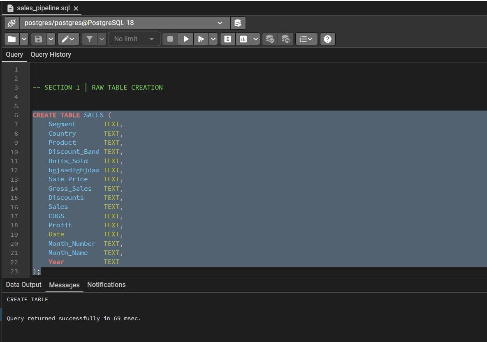
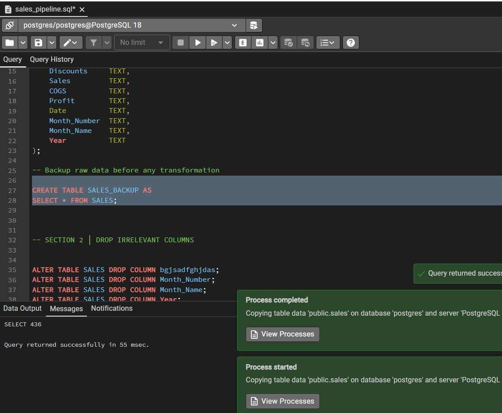
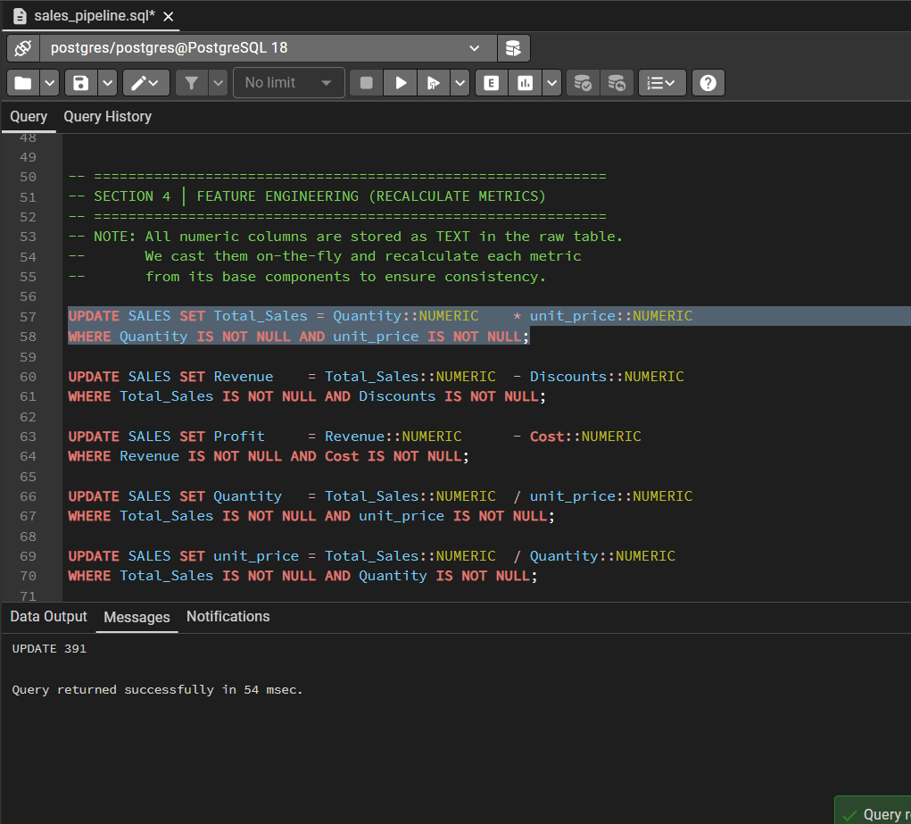
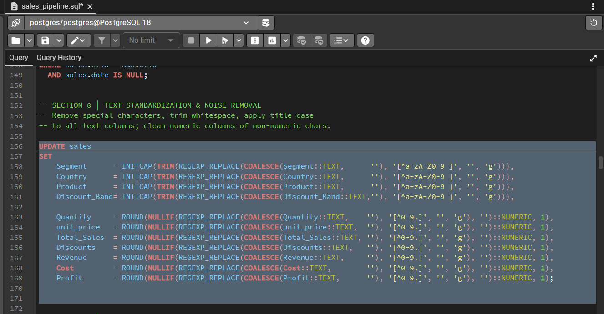
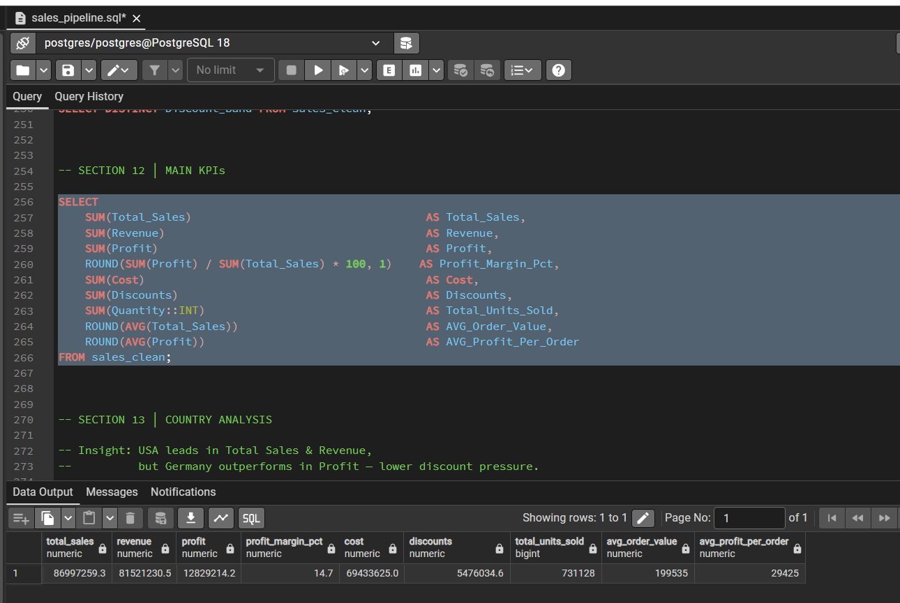
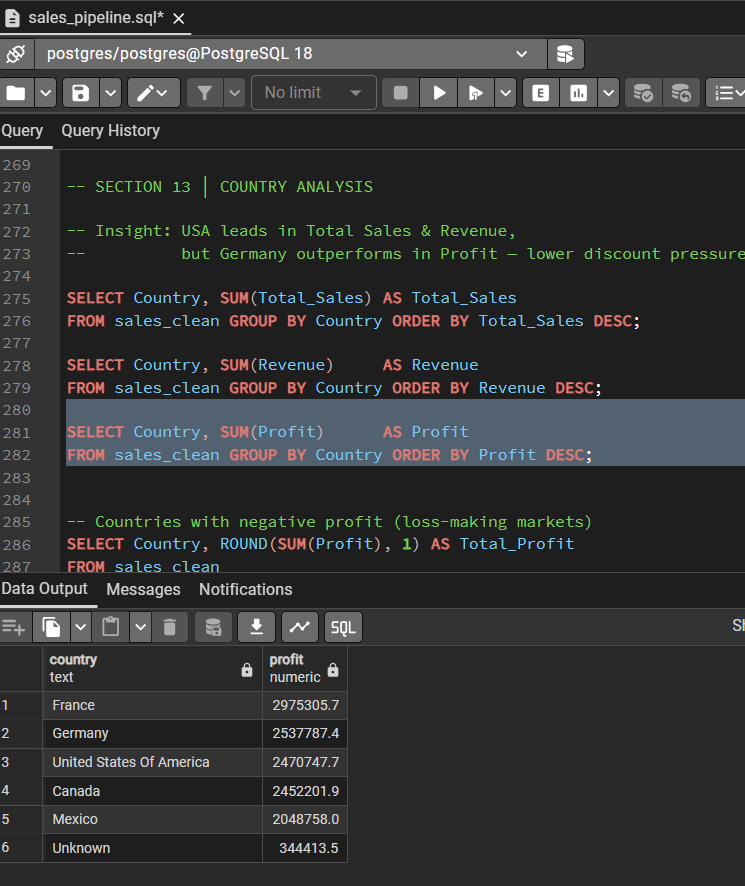

📊 Sales Data Cleaning & Analytics Project

🚀 Overview
This project is an end-to-end SQL data pipeline designed to clean, transform, and analyze a financial sales dataset. It demonstrates a complete data analytics workflow using SQL only — from raw data ingestion to generating actionable business insights.

---

 🛠️ Tools & Technologies
* **Database:** PostgreSQL
* **SQL Techniques:** CTEs, Window Functions, Aggregations, Data Cleaning, and Regex
* **Environment:** pgAdmin 4

---

 🔄 Project Workflow

 1. Data Ingestion
* Created raw sales table from the dataset.
* Backed up original data to preserve raw input.
****

 2. Data Cleaning & Standardization
* Removed irrelevant and corrupted columns.
* Renamed columns for consistency and readability.
* Standardized schema structure.
****

3. Feature Engineering & Type Casting
* Recalculated key financial metrics: **Total Sales, Revenue, Profit, Cost**
* Converted columns from `TEXT` to appropriate numeric and date types to ensure consistency.
****
 4. Data Quality Assurance
* Replaced NULL categorical values with `"Unknown"`.
* Applied average imputation for numeric fields.
* Verified zero NULL values across all critical columns after the cleaning process.
****

 5. Final Dataset
* Created a clean analytical table: `sales_clean` optimized for reporting.

---

 📈 Key KPIs & Insights
* **Total Revenue & Profit:** Extracted core business metrics.
* **Regional Performance:** Identified that the USA leads in revenue while Germany shows higher profit efficiency.
****

---
 💡 Analysis Performed
* **Country Analysis:** Analyzing performance by market.
* **Product Analysis:** Identifying high-volume vs. high-margin products.
* **Pareto (80/20) Analysis:** Understanding revenue contribution.
****

---

 🎯 Project Objective
To demonstrate real-world SQL capabilities in building data cleaning pipelines, performing business analysis, and extracting actionable insights for decision-making

---

 👨‍💻 Author
   Omar Essam

